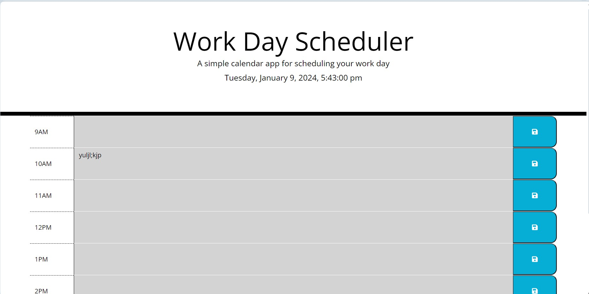

# Third-Party-APIs-Daily-Planner-App

## Description

Simple calendar application that allows a user to save events for each hour of the day by modifying starter code.

Deployed application: https://iabramidze.github.io/Third-Party-APIs-Daily-Planner-App/

## References

Removing multiple classes (jQuery) - https://stackoverflow.com/questions/1485647/removing-multiple-classes-jquery